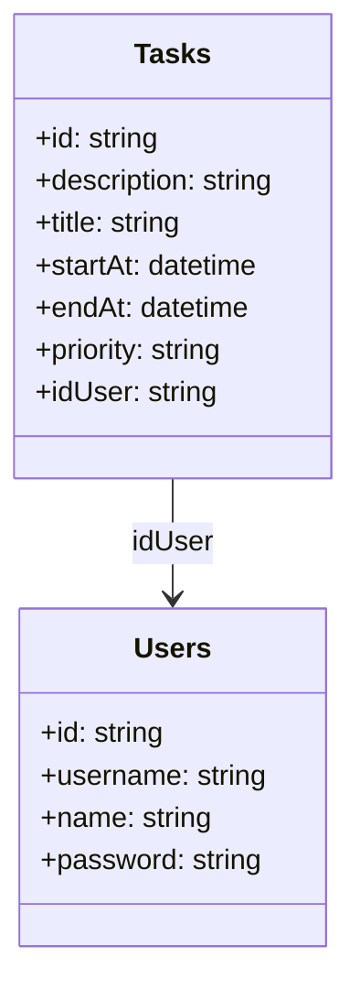

# TODO List

API para gerenciar tarefas (CRUD) onde será possível cadastrar tarefas, listar tarefas, buscar tarefas pelo id, editar e excluir tarefas (CRUD) com usuário e senha.

## Tecnologias
- **[Java 17](https://www.oracle.com/java/technologies/javase/jdk17-archive-downloads.html)**
- **[Spring Boot 3](https://spring.io/projects/spring-boot)**
- **[PostgreSQL](https://www.postgresql.org/)**
- **[Spring Data JPA](https://spring.io/projects/spring-data-jpa)**
- **[OpenAPI (Swagger)](https://swagger.io/specification/)**
- **[Railway](https://railway.app/)**

## Diagrama de Classes

## Documentação da API (Swagger)

### [URL Produção: https://todolist-production-2c04.up.railway.app/swagger-ui/index.html](https://todolist-production-2c04.up.railway.app/swagger-ui/index.html)

### [URL Local: http://localhost:8080/swagger-ui/index.html](http://localhost:8080/swagger-ui/index.html)

